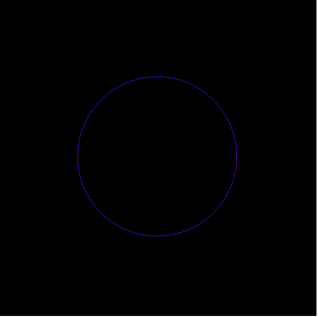
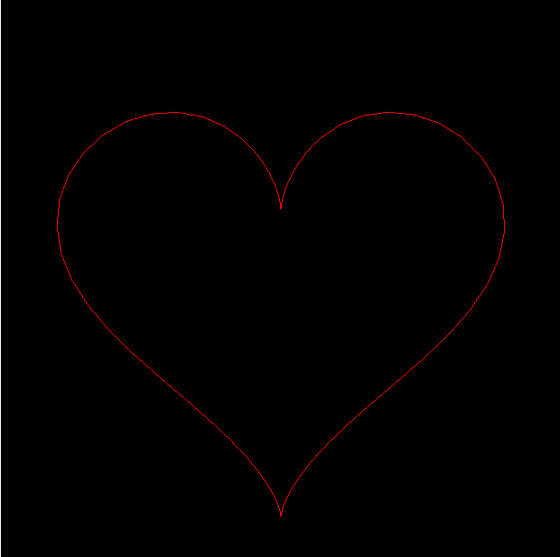
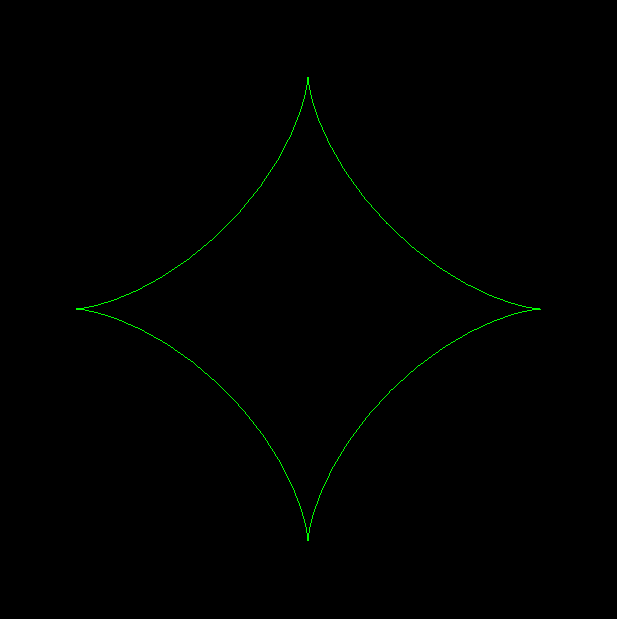
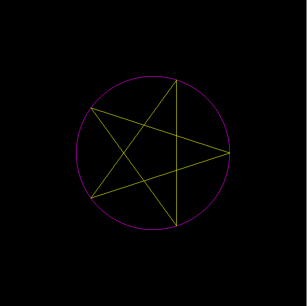

# Lista de exercicios do Laboratório 01

Com base nos códigos fornecidos no Lab01, faça:

1. Crie uma página que permita ao usuário escolher uma das formas abaixo, via interface gráfica, e uma vez selecionada a desenhe na tela. Repare nas cores usadas em cada figura, elas devem ser mantidas na sua implementação.

Figura 1 
  
  

Figura 2 [^1]

   

Figura 3 [^2]

   

Figura 4

  

2. Modifique os scripts do item anterior para que gerem cores diferentes para cada vertice. Utilize um padrão similar as cores do sistema HSV, como ilustra a figura abaixo.

3. Construa um *Vertex Shader* para o script do item 2, que modifique a geometria das figuras construidas de forma que elas aparentem "pulsar", ou seja, aumentar e diminuir de tamanho de forma cíclica (use como base o exemplo de animação para gerar o efeito de forma automática). **DICA: pense em expansão e contração como um fator multiplicativo aplicado as coordenadas**

4. Modifique o exemplo *Vertex Shader* do Lab01 para que o movimento do plano simiule o movimento das ondas do mar, ou seja, oscile para cima e para baixo com o tempo. 

5. Com base no mesmo exemplo do *Vertex Shader* do Lab01, faça com que o "mapa do terreno" gerado tenha uma escala de cores similar a dos mapas de relevo dos atlas de geografia. 

6.  Modifique o exemplo *Fragment Shader* do Lab01 para que ele gere o padrão de cores igual ao que pode ser visto em cada face do cubo do sistemas de cores RGB. Crie uma interface que permita ao usuário selecionar qual face quer visualizar (ex: RG, GB,...).

[^1]:(veja a [formula dessa curva](https://brilliant.org/problems/lovely-heart-curve/).)
[^2]:(veja a [formula dessa curva](http://paulbourke.net/geometry/astroid/).)
